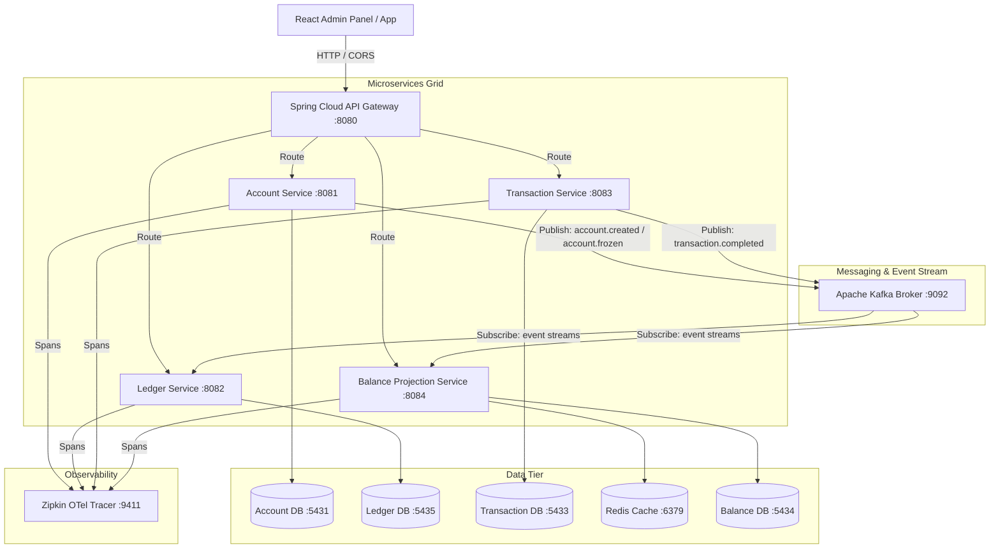

# PayVora Core – Distributed Neobanking & Double-Entry Ledger Engine

[](https://openjdk.org/)
[](https://spring.io/projects/spring-boot)
[](https://kafka.apache.org/)
[](https://redis.io/)
[](https://www.postgresql.org/)
[](https://react.dev/)

PayVora is a high-performance, event-driven core neobanking platform designed using a distributed microservices architecture. It features a robust double-entry accounting ledger system, real-time balance projection pipelines, high-yield wealth vaults with automated daily APY compounding, and automated KYC processing pipelines.

---

## 🏛️ System Architecture

The platform operates on a decoupled microservices model where each service maintains domain isolation with its own PostgreSQL database. Services communicate asynchronously using Apache Kafka to ensure eventual consistency, and requests are orchestrated through a central API Gateway.



---

## 🚀 Key Features

* **Double-Entry Ledger Invariants:** Prevents deposit drift and ensures balance consistency. A strict double-entry validation algorithm checks balance sufficiency and prevents unauthorized overdrafts.
* **Event-Driven Balance Projection:** Rather than querying heavy transaction history databases, a specialized projection engine consumes Kafka transaction streams and writes read-optimized balance projections to a dedicated query database.
* **Treasury & Investment Desk:** Enables automated corporate fund flow governance. Bank administrators can request capital injections from founder clearing accounts to user yield reserves and place treasury investments (T-Bills, AAA Bonds).
* **Automated Wealth Vault Interest Compounding:** Features an administrative controller that compounded interest automatically daily on active user wealth vaults based on dynamic platform savings target rates.
* **OCR & Selfie KYC Matching:** Integrates local automated passport and ID scanner pipelines with matching scoring and OCR verification rules to flag risk scores prior to account activation.
* **Distributed Tracing & Rate Limiting:** Enforces security rate limits using Redis token buckets at the Gateway level, and logs request spans using OpenTelemetry routed to Zipkin.

---

## 📁 Repository Structure

```
bank-ledger/
│
├── api-gateway/                 # Spring Cloud routing, rate-limiting, and security filters
├── account-service/             # User profiles, KYC document scanning, and MFA credentials
├── ledger-service/              # Double-entry ledger core logic, accounting, and limits validation
├── transaction-service/         # Transfers, investments, capital injections, and APY accrual scheduler
├── balance-projection-service/  # Event-driven consumer executing fast balance queries
│
├── frontend/                    # Vite React dashboard (TypeScript, TailwindCSS, Chart.js)
│
└── docker-compose.yml           # Local infrastructure stack (PostgreSQL, Kafka, Redis, Zipkin)
```

---

## 🛠️ Quick Start & Installation

### 1. Prerequisites
Ensure you have the following installed on your machine:
* Java Development Kit (JDK) 21
* Maven 3.9+
* Docker & Docker Compose
* Node.js v18+

### 2. Start Infrastructure
Run the following command at the root directory to spin up the databases, Redis cache, and Kafka broker:
```bash
docker compose up -d
```

### 3. Build & Package Microservices
Compile and generate executable JARs for all backend applications:
```bash
./mvnw clean package -DskipTests
```

### 4. Run the Backend
Launch the services (in separate terminals or in the background):
```bash
# Gateway
java -jar api-gateway/target/api-gateway-1.0.0.jar
# Account Service
java -jar account-service/target/account-service-1.0.0.jar
# Ledger Service
java -jar ledger-service/target/ledger-service-1.0.0.jar
# Transaction Service
java -jar transaction-service/target/transaction-service-1.0.0.jar
# Balance Projection Service
java -jar balance-projection-service/target/balance-projection-service-1.0.0.jar
```

### 5. Run the Admin Dashboard UI
Navigate to the frontend folder, install dependencies, and start the development server:
```bash
cd frontend
npm install
npm run dev
```

---

## 🛡️ Security & Compliance

* **Stateless Authentications:** Protected by stateless JWT tokens verified at the API Gateway.
* **Two-Factor Authentication (2FA):** Secures account configurations using Twilio/MFA.
* **Anti-Fraud Controls:** Transaction risk scoring checks, withdrawal lock policies, and administrative security PIN overrides (`1234` by default for sandbox admin).
